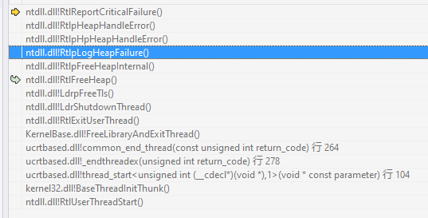

> 最终还是觉得`log`写在`Readme`里面太多了，所以决定搬到这里来

# Log

+ 当客户端主动断开的时候，服务端会崩溃

  > 原因是对`Recv`的返回值预计错误，以为recv返回0就表示对端断开。如果对端close()这里返回0，如果直接关闭进程，返回-1

+ 如果给select函数第三个参数设置超时时间会有`10022`错误

+ 客户端Packet类中取包长多了2

  > `packet.h`里面传入的`data_len`的结果就是包含`sid`的包长度，所以不需要加上`HEADER_SIZE`

+ 到来的请求会导致客户端关闭

  > 通过添加 getchar()看到了控制台的输出，是select出现了 10038错误，翻译过来就是对不是套接字的变量执行了套接字操作。这个一般是套接字被关闭了，但是依旧操作导致的。所以着重检查哪里被关闭了。
  >
  > 最终在检查Poll注册的时候发现，_handle_http没有被取消注册。这就导致 http服务器与客户端断开连接的时候，关闭套接字，但是select的监听队列中还在。所以在关闭套接字的地方取消注册就好了。另外，取消注册会导致\_readfd_map结构的改变，所以每次需要考虑erase之后迭代器失效的问题。

+ 尝试实现Https的处理，客户端好像不会响应

  > 忘记看是谁先断开的了

+ sid会变成52685

  > 出现了好几次，然后突然想起来，这个值是不是一个很特殊的值。突然明白了什么，十六进制的cdcd，似乎是个比较特殊的值，然后去查了一下["烫烫烫屯屯屯" 那些事 - 知乎 (zhihu.com)](https://zhuanlan.zhihu.com/p/27253604)
  >
  > 明白了这是没有被初始化的堆内存，那么问题就只能是在收包函数里面了。但是怎么验证呢？

+ 对于上面的问题，原因是因为

  > 我为了省事儿，每次`OnRecv()`的时候都会新`new`缓冲区，结束的时候`free`掉，这时候会有一个问题。
  >
  > 接收头部的时候，申请一个，接收另一段的时候是新的内存。如果一个包被分成了三段。那么最后一段就是在一个全新的缓冲区的尾部，头部当然就是`cdcd`了。前面几个请求没有出问题可能是脸白，也就是没有出现三段包。
  >
  > 不能偷懒啊 啊啊啊

+ 当运行一段时间之后(大约400个session)会出现异常的包头大小

  > 会突然出现一个包头大小超过预定大小的包头
  >
  > 目前来看，可能是因为读取的顺序被破坏了。或者根本就是发送的顺序有错。是否考虑对每个会话都使用独立的缓冲区。
  >
  > 如果公用缓冲区的话，会不会出现接收混乱的问题？
  >
  > 也就是，A包长度50，B包长度60。A先接受了30，然后结果开始接收B的头？这个应该不会，发送方应该会保证以Send的顺序发送吧。也就是不应该出现一个包中混杂别的包的情况。理由是每次出现这样的问题时，pos的值都是0，也就是说并没有前一个包。
  >
  > 绝对保证包确实接收完了，最终ret的和等于预计包大小

+ 对于上面的问题，终于找到了原因

  > 是因为没有考虑接收包头的时候返回值为1的情况，算是一个比较极端的情况。如果返回值是1，那么这个包头的大小就不正确了。比如这次是零，那么下次再调用`RecvPacket`的时候，肯定就错位了，所以会得到一个很大的`len`，所以这次的话，接受包头使用`RecvN()`函数来做，保证一定会接收到包头。而且是完整的，当然这个实现方案的性能估计不会很好。

+ 添加了`AddressSanitizer`

  > 发现了两个问题了已经，首先就是`BaseNet`的析构函数不是虚函数，导致子类的析构函数没有被调用，导致内存没有完全释放。其次就是`RequestHandle`对象，被释放了之后，可能会被`poll`调用到
  >
  > 具体来看，就是接收到了客户端消息，需要清理掉`session`，清理完毕之后没有从`poll`中删除，导致被调用到了。所以，对于各个对象的生命周期还是需要好好理清楚的。其次，发现`gdb`下条件断点比`assert`好用...

+ `[BUG]` 在`poll`的循环中执行`OnRecv()`的时候，里面可能会有释放`poll`池中对象的情况 (已解决)

  > 导致的情况就是会出现内存非法使用。如果不是开启`ASan`，我其实也不会注意到这个问题。现在的解决办法就是通过在`BaseNet`中添加一个`delete`的标志位，需要删除的时候只是设置标志位。最终删除的时候是在`poll`里面删除。这样可以避免非法使用内存的问题。实际上这个问题还是比较重要的，比如说公司项目里面`session`和`filter`的设计，都是使用了延时删除的设计。
  
+ `[BUG]` 打开比较慢的网站时会被阻塞 (已解决)

  > 因为是单线程的客户端，所以如果遇到了比较慢的`http`服务器，将会阻塞在`connect`这个地方。所以比较好的解决方案应该就是把连接的过程放到线程池里面去。明天主要就是做这个事情，如果可以，解决掉客户端连接结束的`bug`，应该重新梳理一下客户端逻辑了。

+ 添加了状态查看器

  > 现在可以在服务端运行的时候通过访问`7200`端口查看到所有的客户端信息了。接下来，会把信息显示的更有可读性一点。然后再加上密码？如果要添加密码的话，就必须要实现`base64`了，这个还是比较麻烦的。接下来要做的事情，应该就是最难的事情了 ---- 找客户端的bug，还有将连接和数据传输分离开来。
  
+ 分离了客户端连接操作和与服务端数据传输的操作

  > 现在客户端连接`http`服务器的时候是通过开启一个单独的线程去连接的，这样就不会出现一个在连接响应特别慢的服务器的时候阻塞整个程序的情况了。
  >
  > 实际上我觉得这次分离比想象中的顺利不少。
  >
  > 效果也是显著的，分离之前控制台的输出都是一卡一卡的，但是现在已经完全流畅起来了，并且网络流量也完全占满了服务器的带宽(应该) 同时打开网页的速度也更快了。

+ `[BUG]` 客户端会出现接受结束的问题

  > 会不停出现这样下面的输出
  >
  > ```C
  > [Debug]: 接收结束 ret=0 sid=[47]
  > ```
  >
  > 并且会导致客户端`CPU`使用率上涨，然后整个电脑风扇飞速旋转，看上去可能是个逻辑错误。梳理客户端逻辑已经很必要了。

+ `[BUG]` 服务端莫名其妙的崩掉了

  > 在出现了下面的输出之后
  >
  > ```C
  > [Debug]: --> Request 4094 sid=85
  > [Debug]: <-- Client 4096 sid=85
  > [Debug]: --> Request 4094 sid=85
  > [Debug]: <-- Client 4096 sid=85
  > [Debug]: --> Request 4094 sid=85
  > [Debug]: <-- Client 4096 sid=85
  > [!!!!!!!!] Send:  ret/len: 3766/4094
  > ```
  >
  > 现在并没有头绪，也许，以后运行的时候都使用`gdb`挂着，最起码知道为什么突然崩溃了。。。
  
+ `[BUG]` 非法连接导致出现服务端拒绝服务

  > 如果有个人，与服务器建立很多很多的连接，但是什么数据都不发送，是否会导致占用内存过多？又或者对于现在的状况，如果只发送一个字节(数据包头是`2`字节)，服务端将会卡在`RecvN()`函数的位置。导致出现拒绝服务攻击。那就需要重新设计`RecvPacket()`函数
  
+ `[optimiztion]` 关于防止失效的`sid`重新添加的两个方案

  > 第一个就是收回删除`HttpProxy`对象的权力，统一通过服务端发送的指令删除
  >
  > 第二个就是通过判断`sid`来决定是否添加。如果`sid`比记录的最大的`sid`要小，那就不添加(到最大`sid`需要重置)
  >
  > 两种方案都可以，相比之下第一个更好一点。第一时间其实考虑的是，如果和服务端断开连接了该怎么办。是否可能有没有顺利传达的结束会话的指令？应该是不会的。所以第一种方案是首选，或者两种方法共存？不过鉴于是一个优化，优先级是最低的。
  
+ 断点错误

  
  
  可能是因为在子线程里面出现了内存越界的问题，具体就是启动`HttpConnecter`之后，`HttpProxy`对象被删除，导致里面出现问题。解决这个问题目前方案如下
  
  + 依旧是使用延时删除的方法，移除的时候只是标记删除，但是，最重要的那个删除是接收到了服务端`CMD_END_SESSION`的指令导致的删除，这个是一次性的。如果这次不删除，那么就会导致客户端会再发送和这个`session`相关的数据，导致服务端再次通知这个指令尝试删除。实际上可以预估，这个过程触发的不会非常频繁，可以考虑使用这个方法，不过是增加禁止删除的标志位，在进入子线程的时候标记，使用完毕之后取消。如果子进程链接失败了，会直接调用`remove_hp`函数删除掉对象，如果成功了，`http`服务器会回复数据，而这个数据会发给服务端，但是服务端已经没有对应的`session`了，所以会发送`CMD_END_SESSION`的指令，最终删除掉这个会话。可能需要等所有子进程退出才能开始清理对象了，实际上也应该如此。对于这次的话，如果程序退出，执行扫尾工作时`remove_hp`是否还判断是否禁止删除呢？如果能够等待所有子进程都退出了，那么就不会有对象被误删的问题了。


+ `ASan`错误

  ```C
  =================================================================
  ==31386==ERROR: AddressSanitizer: heap-use-after-free on address 0x60c000002018 at pc 0x555555564b3b bp 0x7fffffffdbb0 sp 0x7fffffffdba0
  READ of size 8 at 0x60c000002018 thread T0
      #0 0x555555564b3a in HttpRequestHandle::OnRecv() (/root/code/Server/server/main+0x10b3a)
      #1 0x5555555608b6 in GNET::Poll::loop_poll() (/root/code/Server/server/main+0xc8b6)
      #2 0x55555555ddf5 in main /root/code/Server/server/main.cpp:284
      #3 0x7ffff6288bf6 in __libc_start_main (/lib/x86_64-linux-gnu/libc.so.6+0x21bf6)
      #4 0x55555555aed9 in _start (/root/code/Server/server/main+0x6ed9)
  
  0x60c000002018 is located 88 bytes inside of 128-byte region [0x60c000001fc0,0x60c000002040)
  freed by thread T0 here:
      #0 0x7ffff6ef99c8 in operator delete(void*, unsigned long) (/usr/lib/x86_64-linux-gnu/libasan.so.4+0xe19c8)
      #1 0x555555563fca in HttpRequestHandle::~HttpRequestHandle() (/root/code/Server/server/main+0xffca)
      #2 0x555555564b03 in HttpRequestHandle::OnRecv() (/root/code/Server/server/main+0x10b03)
      #3 0x5555555608b6 in GNET::Poll::loop_poll() (/root/code/Server/server/main+0xc8b6)
      #4 0x55555555ddf5 in main /root/code/Server/server/main.cpp:284
      #5 0x7ffff6288bf6 in __libc_start_main (/lib/x86_64-linux-gnu/libc.so.6+0x21bf6)
  
  previously allocated by thread T0 here:
      #0 0x7ffff6ef8448 in operator new(unsigned long) (/usr/lib/x86_64-linux-gnu/libasan.so.4+0xe0448)
      #1 0x55555556553a in Httpd::OnRecv() (/root/code/Server/server/main+0x1153a)
      #2 0x5555555608b6 in GNET::Poll::loop_poll() (/root/code/Server/server/main+0xc8b6)
      #3 0x55555555ddf5 in main /root/code/Server/server/main.cpp:284
      #4 0x7ffff6288bf6 in __libc_start_main (/lib/x86_64-linux-gnu/libc.so.6+0x21bf6)
  
  SUMMARY: AddressSanitizer: heap-use-after-free (/root/code/Server/server/main+0x10b3a) in HttpRequestHandle::OnRecv()
  Shadow bytes around the buggy address:
    0x0c187fff83b0: 00 00 00 00 00 00 00 00 00 00 00 00 00 00 00 00
    0x0c187fff83c0: fa fa fa fa fa fa fa fa fd fd fd fd fd fd fd fd
    0x0c187fff83d0: fd fd fd fd fd fd fd fd fa fa fa fa fa fa fa fa
    0x0c187fff83e0: 00 00 00 00 00 00 00 00 00 00 00 00 00 00 00 00
    0x0c187fff83f0: fa fa fa fa fa fa fa fa fd fd fd fd fd fd fd fd
  =>0x0c187fff8400: fd fd fd[fd]fd fd fd fd fa fa fa fa fa fa fa fa
    0x0c187fff8410: fd fd fd fd fd fd fd fd fd fd fd fd fd fd fd fd
    0x0c187fff8420: fa fa fa fa fa fa fa fa fd fd fd fd fd fd fd fd
    0x0c187fff8430: fd fd fd fd fd fd fd fd fa fa fa fa fa fa fa fa
    0x0c187fff8440: fd fd fd fd fd fd fd fd fd fd fd fd fd fd fd fd
    0x0c187fff8450: fa fa fa fa fa fa fa fa fd fd fd fd fd fd fd fd
  Shadow byte legend (one shadow byte represents 8 application bytes):
    Addressable:           00
    Partially addressable: 01 02 03 04 05 06 07 
    Heap left redzone:       fa
    Freed heap region:       fd
    Stack left redzone:      f1
    Stack mid redzone:       f2
    Stack right redzone:     f3
    Stack after return:      f5
    Stack use after scope:   f8
    Global redzone:          f9
    Global init order:       f6
    Poisoned by user:        f7
    Container overflow:      fc
    Array cookie:            ac
    Intra object redzone:    bb
    ASan internal:           fe
    Left alloca redzone:     ca
    Right alloca redzone:    cb
  ==31386==ABORTING
  ```

  
